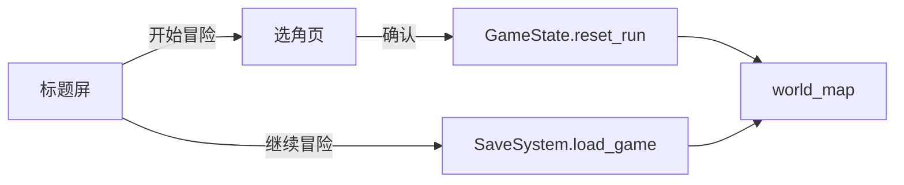

# 男性主角「光之剑士」与开局选角

## Report

## [S1] Problem

当前工程只有猫耳少女一套主角引擎帧，`PlayerAssetLibrary.frames()` / `PixelStyleManager` 写死单角色路径。用户要新增男性持剑主角「光之剑士」，**不得覆盖**现有少女；希望开局可选主角。玩法机制保持纯外观换皮，不引入数值/技能差异。

## [S2] Design

### 角色目录

| hero_id | 显示名 | 状态 |
|---------|--------|------|
| `cat_girl` | 猫耳少女 | 现有 40 张引擎帧，默认/回退 |
| `light_swordsman` | 光之剑士 | 新增；身份锚点见 [S2.4] |

- 契约 id 稳定；显示名走 `LocalizationSystem`。
- 未知 / 缺失 `hero_id` **一律回退** `cat_girl`（旧存档、缺帧、空字符串）。
- 新增角色只扩展目录项，不改玩法数值：同一 `BalanceConfig`、同一技能/打击框。

### 素材路径

```
assets/sprites/player/cat_girl/           # 现有帧迁入（不删不改像素）
  frame-*.png, run-frame-*.png, ...
assets/sprites/player/light_swordsman/    # 新角色
  <prefix>_{action}_{ii}.png              # 与 PlayerAssetLibrary 命名一致
docs/pipeline/player-hero-light-swordsman.txt  # prompt 归档
```

- 原稿/母版/QA 进 `data/player/raw/light_swordsman/` 或 `.scratch/`，**不进** `assets/`。
- 迁移 `cat_girl` 仅改路径表；像素内容与动画名（idle/run/jump/fall/fall_short/landing/attack1/attack2/hurt/death）不变。

### 运行时接口

**`PlayerAssetLibrary`**

- 目录字段：`DEFAULT_HERO_ID`、`HERO_IDS`、`HERO_DIRS`、`HERO_NAME_KEYS`；动作时序共享 `ANIMATION_META` + `ACTION_FRAME_FILES`。
- `frames(hero_id: String = "") -> SpriteFrames`：空 id 读 `GameState.selected_hero_id`；再失败回退 `cat_girl`。
- `has_hero(hero_id) -> bool`
- 缺帧：默认角色缺文件 `push_error`；非默认角色缺文件/半套帧**整段回退**默认角色对应动作（身份与节奏完整）；解码失败 `push_error` 后跳过。
- 现 `pose_texture` 程序化小图保留不动（非主路径）。

**`GameState`**

- `var selected_hero_id: String = PlayerAssetLibrary.DEFAULT_HERO_ID`
- `set_selected_hero_id(id: String)`：非法 id 回退默认并 `push_warning`。
- `reset_run()` **保留** `selected_hero_id`（新开局由选角页写入后再 `reset_run`）。
- `create_snapshot()` 增加 `"hero_id": selected_hero_id`。
- `restore_snapshot()`：读 `hero_id`，缺失/非法 → `cat_girl`。存档 `version` 保持 `1`（新字段可选，向后兼容）。

**`PixelStyleManager`**

- `animator.sprite_frames = PlayerAssetLibrary.frames(GameState.selected_hero_id)`（或等价显式传 id）。

### 开局选角流



- 标题「开始冒险」→ `scenes/ui/hero_select.tscn`，**不再**直接进 `world_map`。
- 「继续冒险」行为不变：读档进图，**不**再选角；`hero_id` 随存档恢复。
- 选角页：并排两卡（预览 idle 帧 + 本地化名），左右/点击切换，确认后 `set_selected_hero_id` → 原 `_start_game` 后半（`reset_run` + loading + `world_map`）。
- 返回标题；与现有 PixelUI / 标题按钮风格一致。
- 新增文案 key（zh/en）：`hero_select_title`、`hero_select_confirm`、`hero_select_back`、`hero_cat_girl`、`hero_light_swordsman`。

### [S2.4] 光之剑士身份锚点（美术）

权威描述在用户 prompt + `docs/pipeline/player-hero-light-swordsman.txt`。锁定识别五要素：

1. 白色蓬松短发（像素层次、顶翘发束）
2. 明亮蓝眼
3. 白 / 深蓝 / 亮蓝 + 金点缀
4. 深蓝披风 + 金色滚边
5. 右手大型蓝白金光属性长剑

- 比例：日系幻想 RPG 少年主角（头略大、腿修长）；**不要** Q 版儿童、**不要**成年重甲骑士。
- 3/4 或侧视引擎帧与现有 256×256、`display_scale=0.25`、脚底锚点对齐；动作集与 `cat_girl` 同构。
- 生成：`image_gen` 身份母版（用户参考图到位后 `identity-preserve` 锁定）→ 按态 `2x2`/`2x3` 网格 → `process_boss_sheet`/`sprite_pipeline`/`generate2dsprite` 后处理 → 目检 contact sheet → 进 `assets/sprites/player/light_swordsman/`。
- 宽剑动作：`scale_strategy=preserve --align feet`，避免剑鞘/披风把 body bbox 缩小。
- **门禁（AGENTS.md）**：源表目检网格 → 安全边 → 像素审计（edges 空、无空帧、无水印）→ contact sheet 目检 → 全部通过才进引擎 smoke。
- 参考图未到：**不**锁身份、**不**批量出动作帧；可先做代码与选角 UI（预览可暂用 `cat_girl` 或占位图，占位不进 `assets/`）。

## [S3] Out of Scope

- 数值 / 技能 / 打击框差异
- 第三角色、局内换人、角色创建自定义
- 按角色区分装备外观（装备叠加层仍共用）
- 重绘或修改 `cat_girl` 像素内容
- 光属性独立技能特效资产（本阶段攻击 FX 仍走现有 FxUtil 路径）

## Tasks

- [x] T1: 开分支与工具链确认 — acceptance: 功能分支就绪；记录 Godot/Python 入口与 worktree 覆盖原因 (covers: S2)
- [x] T2: 写本 spec 并对齐决策 — acceptance: status=designed，决策与接口可实施，无 TBD (covers: S1; S2)
- [x] T3: 多角色资产库与存档 hero_id — acceptance: `PlayerAssetLibrary.frames(hero_id)` 双角色可加载；`cat_girl` 帧迁入子目录后 smoke 通过；snapshot 含/可回退 hero_id (covers: S2; depends: T2)
- [x] T4: 开局选角页并贯通标题流 — acceptance: 开始→选角→进图；继续仍读档；文案中英齐全；选角后 `selected_hero_id` 正确 (covers: S2; depends: T3)
- [ ] T5: 光之剑士身份母版与全套引擎帧 — acceptance: 参考图锁定身份；idle/run/jump/fall/landing/attack1/attack2/hurt/death 帧齐；QC 门禁全过；路径进 `light_swordsman/` (covers: S2.4; depends: T3)
- [ ] T6: smoke/自测 + review + finalize — acceptance: 相关 smoke 命令与结果入 Report；review 通过；status=delivered (covers: S1; S2; S2.4; depends: T3; T4; T5)
